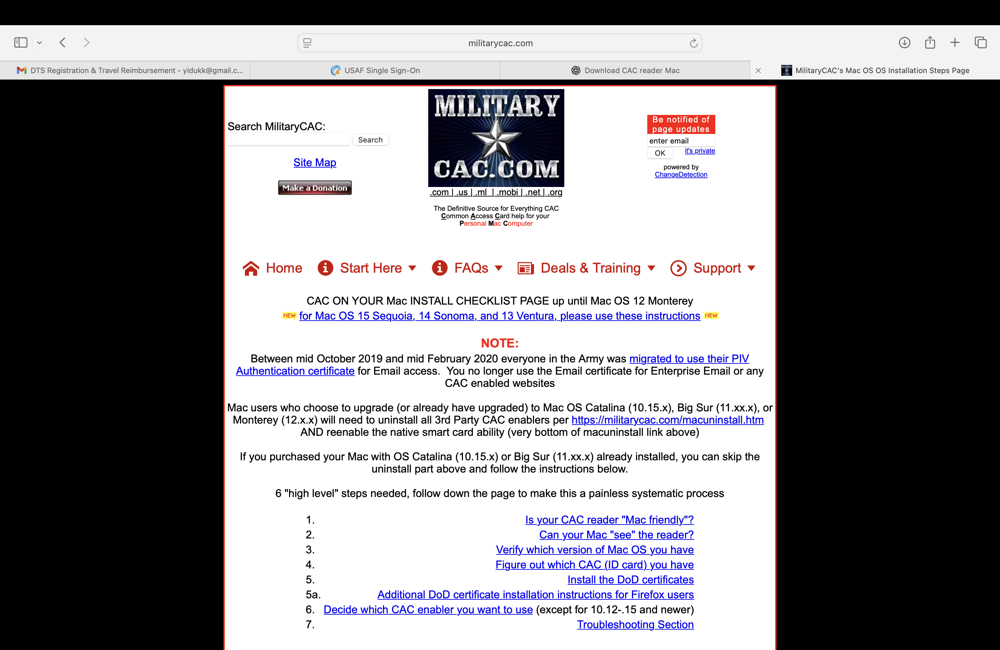

# 🌩️ Cloud + Data Dashboard (.NET 8 + SQLite + Chart.js)

A data-driven cloud metrics dashboard built with **ASP.NET Core Razor Pages**, **Entity Framework Core**, and **Chart.js**.  
It visualizes key metrics (Cost, CPU, Storage, and Network) across **Azure, AWS, and GCP**.




## 🧠 Features
- Interactive charts powered by **Chart.js**
- Fake seeded data via EF Core for demo purposes
- Local **SQLite** database (no setup required)
- Responsive Bootstrap layout
- REST API endpoints for chart data

## 🧰 Tech Stack
- **.NET 8 / ASP.NET Core**
- **Entity Framework Core**
- **SQLite**
- **Chart.js**
- **Bootstrap 5**

## 💻 Running Locally
1. Clone the repo  
   ```bash
   git clone https://github.com/yidukk/CloudDataDashboard.git
